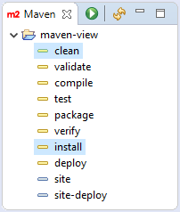

#  Eclipse Maven View

- **Author:** [Stef Schulz](mailto:s.schulz@slothsoft.de)
- **Repository:** <https://github.com/slothsoft/eclipse-maven-view>
- **Open Issues:** <https://github.com/slothsoft/eclipse-maven-view/issues>
- **Wiki:** <https://github.com/slothsoft/eclipse-maven-view/wiki>

A plug-in that recreates IntelliJ IDEA&apos;s Maven View for Eclipse:

## Getting Started

### Prerequisites

You need at least **Java 8** or above to run the code.

### Using the Plug-in

**Update Site:** http://github.com/slothsoft/eclipse-update-site/raw/master/
   
1. Open your Eclipse IDE
2. Open the "Install" dialog (*Help* -> *Install New Software*)
3. Enter the URL of the update site
4. Search for the plug-in ID ('de.slothsoft.mavenview') or its name (**Maven View**); you might need to deselect "Group items by category" for the plug-ins to show up
5. Select and install via "Finish"
     

##  Versions

| Version       | Eclipse      | Description      |
| ------------- | ------------ | ---------------- |
| [1.0.1](https://github.com/slothsoft/eclipse-maven-view/milestone/1?closed=1)         | `2018-12` | Various bugfixes |
| 1.0.0         | `2018-12` | Proof of concept |
   

## Features

*See the [wiki](https://github.com/slothsoft/eclipse-maven-view/wiki) for more information.*

## Developer Guide 

- [Release Process](https://github.com/slothsoft/eclipse-update-site/wiki/Release-Process)

## License

This project is licensed under the MIT License - see the [MIT license](LICENSE) for details.
